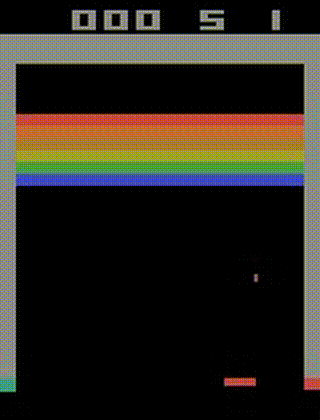
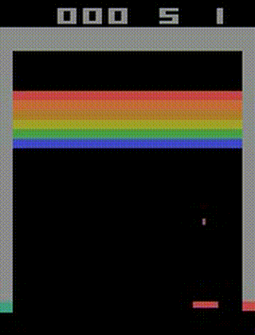
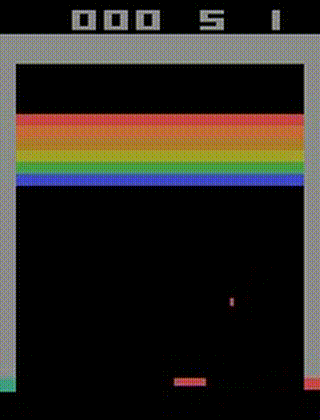

# Breakout RL Agent

This repository contains code to train and evaluate reinforcement learning (RL) agents in the Breakout Atari environment using Stable-Baselines3.

## Features
- Training and saving checkpoints.
- Evaluation and video recording.

## Side-by-Side Comparison of Training Progress

| Trained for 200k Steps | Trained for 10M Steps | Trained for 32M Steps |
|:---------------------:|:---------------------:|:----------------------:|
|  |  |  |

In the table above, you can see how the agent's performance improves with more training. The first GIF shows an agent trained for 200 thousands steps, the second for 10 million steps, and the third for 32 million steps.
